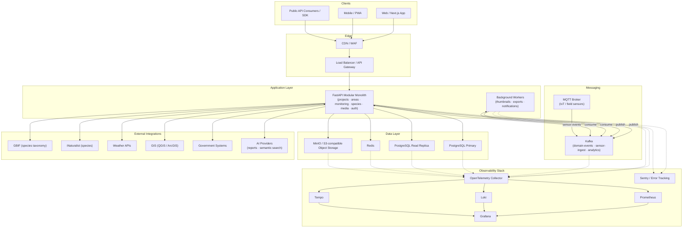
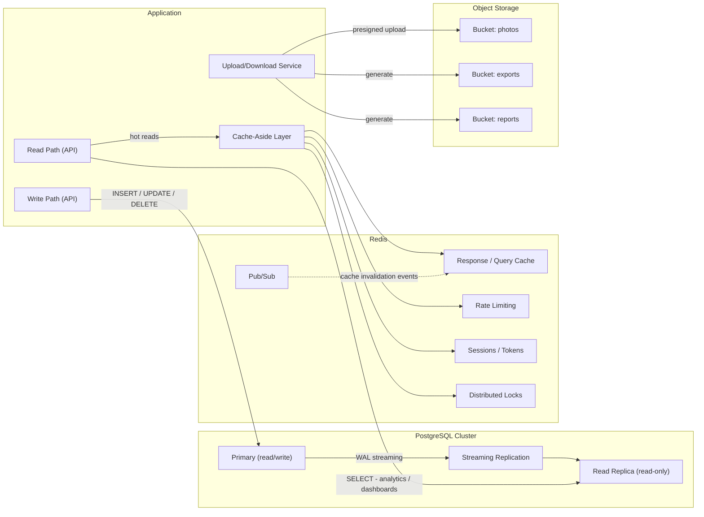
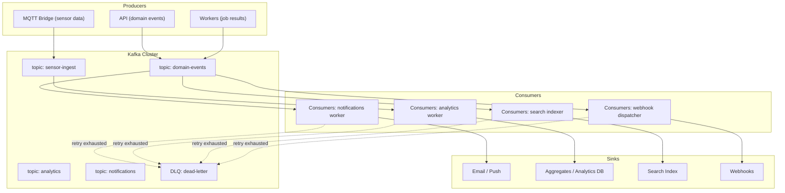
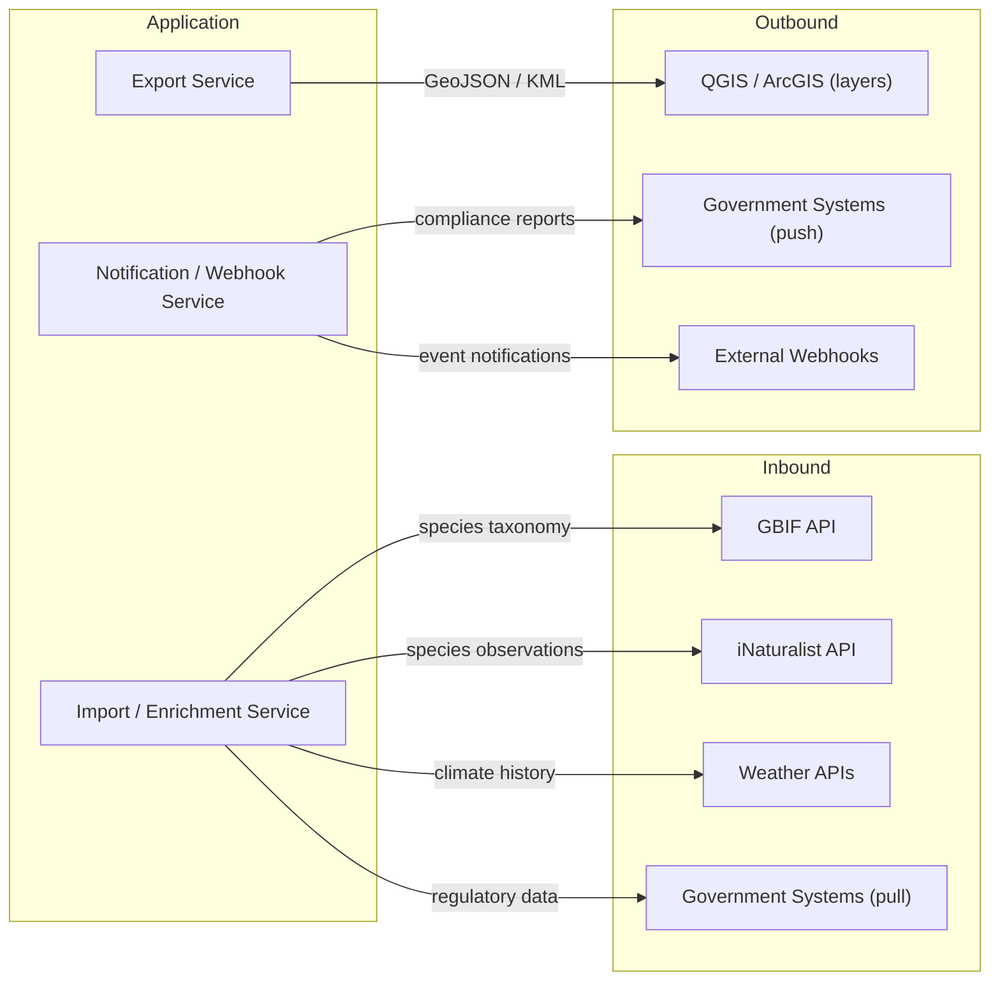
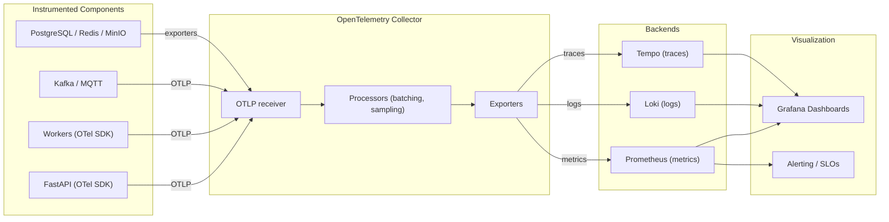
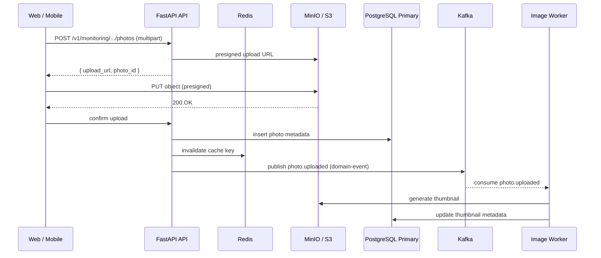

# OpenForest Architecture Scheme

> Target-state architecture of the final product.
>
> Status: Living Document
>
> This document is a scheme (diagram-centric overview). For prose details, see `ARCHITECTURE.md`; for the evolution path, see `ROADMAP.md`.

---

## 1. System Overview

---

## 2. Detailed Diagrams

### 2.1 Data Layer

### 2.2 Event-Driven / Messaging

### 2.3 External Integrations

### 2.4 Observability Stack

### 2.5 Photo Upload Flow

---

## 3. Data & Event Flow Notes

- **Write path:** API writes to PostgreSQL Primary only; all mutations go through FastAPI.
- **Read path:** Dashboards and hot reads hit the PostgreSQL Read Replica; hot queries are served from the Redis cache (cache-aside). Cache is never the source of truth.
- **Upload flow:** Objects go directly to MinIO via presigned URLs; metadata lands in PostgreSQL; events trigger background thumbnail generation.
- **Event flow:** Domain events are published to Kafka by the API and workers; consumers handle notifications, analytics aggregation, search indexing, and webhook dispatch. Failed messages go to a dead-letter topic after retries.
- **Sensor flow:** IoT/field devices publish over MQTT; the MQTT bridge writes to the Kafka `sensor-ingest` topic for durable, replayable processing.
- **Observability:** Every component emits OpenTelemetry (metrics, logs, traces) via the collector; Prometheus, Loki, and Tempo are the backends; Grafana is the single view; Sentry captures errors.

---

## 4. Legend / Conventions

- **Solid arrow (`-->`)** — synchronous call or data transfer.
- **Dashed arrow (`-.->`)** — asynchronous, telemetry, or control signal.
- **Double-headed arrow (`<-->`)** — bidirectional relationship (e.g., consume/publish, push/pull).
- **Subgraphs** group components by concern: clients, edge, application, messaging, data, external, observability.
- The **overview diagram** (section 1) is the high-level container map; the **detailed diagrams** (section 2) zoom into each area.
