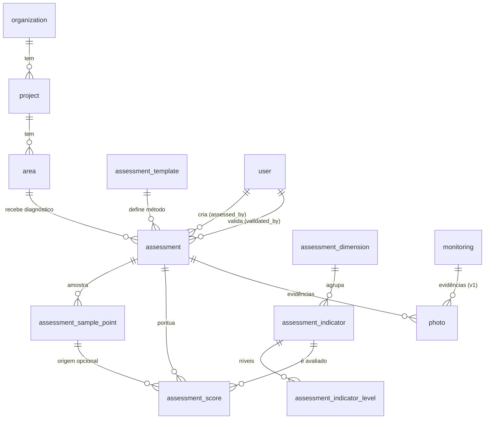

# OpenForest — Database Schema v2

> **Status:** Proposta para o módulo de Diagnóstico de Caficultura Regenerativa + evidências fotográficas.
> **Complementa:** `docs/superpowers/plans/2026-09-05-caficultura-assessments-mobile.md`
> **Migrações:** via Alembic (SQLModel). Não quebra tabelas v1 — é aditivo.

---

## Visão geral

A v1 (tabelas atuais) permanece intacta. As alterações desta v2 são **aditivas**:

1. **7 novas tabelas** do módulo `assessments` (template, dimensões, indicadores, níveis, diagnóstico, pontos de amostragem, scores).
2. **1 coluna aditiva** em `photo` (`assessment_id`, nullable) para fotos de evidência do diagnóstico.

O conteúdo dos templates é **data-driven** (seed `scripts/seed_assessments.py`), armazenado com traduções JSON `{"es": "...", "pt": "..."}`. Multi-tenant é **herdado indiretamente**: `assessment → area → project → organization`; o caso superuser ignora o escopo. Templates são conteúdo público (qualquer usuário autenticado lê).

---

## Novas tabelas

### assessment_template

Catálogo "qual é a metodologia" (ex.: Guía de Caficultura Sostenible y Regenerativa 2025).

| Coluna        | Tipo          | Regras                                   |
|---------------|---------------|------------------------------------------|
| id            | UUID          | PK, `uuid4` (Base)                       |
| name          | varchar       | NOT NULL                                 |
| version       | varchar       | NOT NULL, **UNIQUE**                     |
| created_at    | timestamptz   | NOT NULL (Base)                          |
| updated_at    | timestamptz   | NOT NULL, onupdate (Base)                |

### assessment_dimension

Uma das 8 dimensões do diagnóstico (Suelo, Agronómicas, Agua, Biodiversidad, Microclima, Económico, Social, Política).

| Coluna               | Tipo    | Regras                                      |
|----------------------|---------|---------------------------------------------|
| id                   | UUID    | PK                                          |
| code                 | varchar | NOT NULL, **UNIQUE** (`soil`, `agronomic`, …) |
| name_translations    | JSONB   | NOT NULL `{"es": "...", "pt": "..."}`       |
| sort_order           | int     | NOT NULL default 0                          |
| created_at / updated_at | timestamptz | Base                                |

> Dimensões são globais (não dependem de template) — 1 template (2025-01) para o MVP. Quando houver uma 2ª versão da guia, introduzir `assessment_template_version` (mapeamento template↔dimensão/indicador) — ver `TODO-MOBILE.md`.

### assessment_indicator

Um dos 41 indicadores do diagnóstico.

| Coluna               | Tipo    | Regras                                                 |
|----------------------|---------|--------------------------------------------------------|
| id                   | UUID    | PK                                                     |
| dimension_id         | UUID    | NOT NULL, **FK → assessment_dimension.id**, ON DELETE CASCADE, **INDEX** |
| code                 | varchar | NOT NULL (`soil_cover`, `agronomic_weeds`, …)          |
| title_translations   | JSONB   | NOT NULL `{"es","pt"}`                                 |
| sort_order           | int     | NOT NULL default 0                                     |
| created_at / updated_at | timestamptz | Base                                            |

### assessment_indicator_level

Os 4 níveis (0–3) de cada indicador, com descrição.

| Coluna                    | Tipo    | Regras                                                        |
|---------------------------|---------|---------------------------------------------------------------|
| indicator_id              | UUID    | NOT NULL, **FK → assessment_indicator.id**, ON DELETE CASCADE, **INDEX** |
| level                     | int     | NOT NULL (0..3)                                              |
| description_translations  | JSONB   | NOT NULL `{"es","pt"}`                                        |
| created_at / updated_at   | timestamptz | Base                                                     |

**Constraint único:** `uq_indicator_level (indicator_id, level)`.

### assessment

Uma avaliação (diagnóstico) de uma `area` (finca/lote).

| Coluna         | Tipo        | Regras                                                |
|----------------|-------------|-------------------------------------------------------|
| id             | UUID        | PK                                                    |
| area_id        | UUID        | NOT NULL, **FK → area.id**, ON DELETE CASCADE, **INDEX** |
| template_id    | UUID        | NOT NULL, **FK → assessment_template.id**, ON DELETE RESTRICT |
| title          | varchar     | NOT NULL                                              |
| status         | varchar(16)  | NOT NULL default `draft` — enum `draft|submitted|validated` |
| assessed_by    | UUID        | NULL, **FK → user.id** (auditoria: quem criou)        |
| validated_by   | UUID        | NULL, **FK → user.id**                                |
| validated_at   | timestamptz | NULL                                                  |
| created_at / updated_at | timestamptz | Base                                            |

**Índice composto:** `ix_assessment_area_status (area_id, status)` — otimiza listar rascunhos por finca.

> Escopo multi-tenant: `assessment.area_id → area.project_id → project.organization_id`. Não há tenant na tabela; o servidor filtra pelo join.

### assessment_sample_point

Ponto de amostragem de 20×20 m (≥3 por hectare, metodologia do guia).

| Coluna        | Tipo                 | Regras                                              |
|---------------|----------------------|-----------------------------------------------------|
| id            | UUID                 | PK                                                  |
| assessment_id | UUID                 | NOT NULL, **FK → assessment.id**, ON DELETE CASCADE, **INDEX** |
| name          | varchar              | NOT NULL                                            |
| geometry      | geometry(Point,4326) | NULL (PostGIS)                                      |
| created_at / updated_at | timestamptz | Base                                          |

### assessment_score

Score (0–3) de cada indicador dentro de um diagnóstico. 1 linha por indicador.

| Coluna           | Tipo    | Regras                                                      |
|------------------|---------|-------------------------------------------------------------|
| id               | UUID    | PK                                                          |
| assessment_id    | UUID    | NOT NULL, **FK → assessment.id**, ON DELETE CASCADE, **INDEX** |
| indicator_id     | UUID    | NOT NULL, **FK → assessment_indicator.id**, ON DELETE CASCADE |
| sample_point_id  | UUID    | NULL, **FK → assessment_sample_point.id**, ON DELETE CASCADE |
| level            | int     | NOT NULL (0..3)                                             |
| created_at / updated_at | timestamptz | Base                                                   |

**Constraint único:** `uq_assessment_indicator (assessment_id, indicator_id)` — garante 1 score por indicador por diagnóstico.

---

## Alteração em tabela existente

### photo (aditivo)

| Coluna        | Tipo    | Regras                                        |
|---------------|---------|-----------------------------------------------|
| assessment_id | UUID    | **NULL**, **FK → assessment.id**, ON DELETE CASCADE, **INDEX** |

Sem essa coluna: `nullable=True`. Fotos continuam suportando `monitoring_id` (comportamento v1 intacto). Validação a nível de API: uma `photo` deve ter **ou** `monitoring_id` **ou** `assessment_id` (regra no service, não no banco).

---

## Relacionamentos (visão)

---

## Regras de negócio aplicadas no banco

| Regra | Onde é garantida |
|---|---|
| `level` ∈ {0,1,2,3} | API (Pydantic `Field(ge=0, le=3)`) + lógica de serviço |
| 1 score por indicador por diagnóstico | `UNIQUE (assessment_id, indicator_id)` |
| 4 níveis por indicador | `UNIQUE (indicator_id, level)` |
| 1 template por versão | `UNIQUE (version)` |
| Fotos: `monitoring_id` XOR `assessment_id` | Service (não constraint de banco) |
| Status de diagnóstico: `draft → submitted → validated` | Service (transições proibidas em 409) |
| Nível de transição / prioridades | **Calculado** no service (`compute_transition_level`) — **não** persistido |

---

## Migrações

Duas revisões Alembic (geradas via `alembic revision --autogenerate`), revisadas antes de aplicar:

1. `xxx_caficultura_assessments.py` — cria as 7 tabelas acima (com uniques/indexes).
2. `yyy_photo_assessment_id.py` — `ALTER TABLE photo ADD COLUMN assessment_id UUID NULL` + índice + FK.

> Convenção AGENTS.md: revisar o diff do autogenerate, não executar `upgrade head` às cegas; nunca rodar migração no banco de dev durante a implementação das tasks sem necessidade.