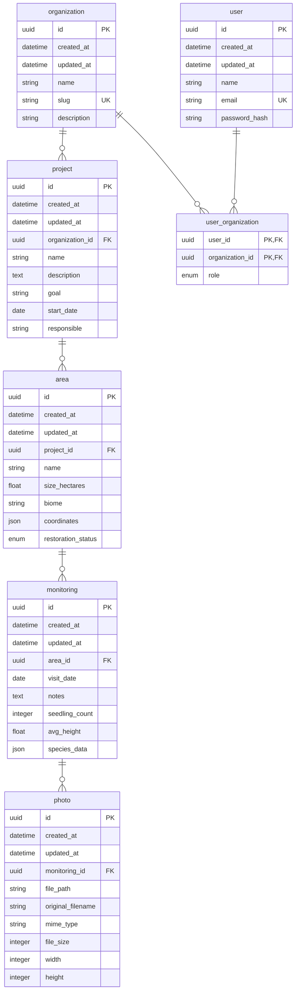

```mermaid
erDiagram
  organization {
    uuid id PK
    datetime created_at
    datetime updated_at
    string name
    string slug UK
    string description
  }

  user {
    uuid id PK
    datetime created_at
    datetime updated_at
    string name
    string email UK
    string password_hash
  }

  user_organization {
    uuid user_id PK, FK
    uuid organization_id PK, FK
    enum role
  }

  project {
    uuid id PK
    datetime created_at
    datetime updated_at
    uuid organization_id FK
    string name
    text description
    string goal
    date start_date
    string responsible
  }

  area {
    uuid id PK
    datetime created_at
    datetime updated_at
    uuid project_id FK
    string name
    float size_hectares
    string biome
    json coordinates
    enum restoration_status
  }

  monitoring {
    uuid id PK
    datetime created_at
    datetime updated_at
    uuid area_id FK
    date visit_date
    text notes
    integer seedling_count
    float avg_height
    json species_data
  }

  photo {
    uuid id PK
    datetime created_at
    datetime updated_at
    uuid monitoring_id FK
    string file_path
    string original_filename
    string mime_type
    integer file_size
    integer width
    integer height
  }

  organization ||--o{ project : ""
  organization ||--o{ user_organization : ""
  user ||--o{ user_organization : ""
  project ||--o{ area : ""
  area ||--o{ monitoring : ""
  monitoring ||--o{ photo : ""
```
