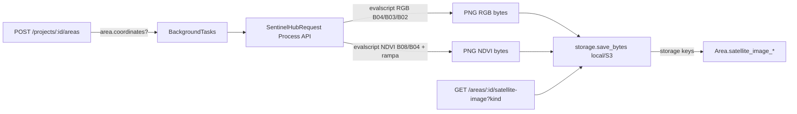

# Sentinel-2 na Criação de Área — MVP Implementation Plan

> **For agentic workers:** REQUIRED SUB-SKILL: Use superpowers:subagent-driven-development (recommended) or superpowers:executing-plans to implement this plan task-by-task. Steps use checkbox (`- [ ]`) syntax for tracking.

**Goal:** Quando o usuário cria uma Área (com coordenadas) dentro de um Projeto, gerar automaticamente uma imagem de satélite Sentinel-2 dela (RGB + NDVI) e disponibilizar via endpoint de download. Nada além disso — outras features de satélite ficam para depois.

**Architecture:** A criação da área dispara uma `BackgroundTask` que chama a **Sentinel Hub Process API** do Copernicus Data Space Ecosystem (CDSE). A API renderiza o PNG pronto via evalscript (RGB com bandas B04/B03/B02; NDVI com rampa verde→amarelo→vermelho inline). Os bytes são salvos no storage existente (local/S3 via `infrastructure/storage.py`) e os caminhos + status são persistidos como colunas no próprio model `Area`. O frontend consome `GET /areas/{area_id}/satellite-image?kind=rgb|ndvi`.

**Tech Stack:** sentinelhub, Pillow, FastAPI BackgroundTasks, storage local/S3, SQLModel, pytest

**Por que Sentinel Hub Process API (e não S3 do CDSE):** o acesso S3 ao `eodata` exige credenciais S3 + GDAL/vsis3 (configuração frágil). A Process API do CDSE é gratuita (30k PUs/mês, ~300 PU/min), precisa só de credenciais OAuth (também gratuitas) e já entrega a imagem renderizada — sem GDAL, sem rasterio, sem download de produto.



## Global Constraints

- Dependências novas: `sentinelhub>=3.12`, `pillow>=10`.
- Config: credenciais OAuth CDSE (`cdse_client_id`, `cdse_client_secret`) + flags (`satellite_image_enabled`, `satellite_image_max_cloud_cover`, `satellite_image_search_window_days`, `satellite_image_max_size`).
- Sem nova tabela: colunas adicionadas ao model `Area`.
- Área sem `coordinates` → cria normalmente, sem imagem (skip silencioso).
- Geração em background — o POST não bloqueia.
- Reutilizar `infrastructure/storage.py`; refatorar para expor `save_bytes(prefix, filename, content, mime)` sem quebrar `save_upload`.
- Padrões existentes: sync `def`, `Annotated`, `Sequence[T]`, erros `HTTPException(detail=[...])`, testes com PostgreSQL real.
- Migração Alembic após alteração no model.

---

## File Structure

### Files to Create
- `backend/src/openforest/api/infrastructure/satellite.py` — `fetch_area_images(geometry, ...)` (Sentinel Hub Process API)
- `backend/src/openforest/api/services/satellite_service.py` — `generate_area_images(area_id)` (background task)
- `backend/tests/test_satellite_image.py` — suite de testes

### Files to Modify
- `backend/pyproject.toml` — dependências
- `backend/src/openforest/api/config.py` — config CDSE
- `backend/src/openforest/api/models/area.py` — colunas de satélite
- `backend/src/openforest/api/schemas/area.py` — `AreaRead` com status/captured_at
- `backend/src/openforest/api/infrastructure/storage.py` — extrair `save_bytes`
- `backend/src/openforest/api/routers/areas.py` — background task + endpoint de imagem
- `backend/src/openforest/api/infrastructure/versions/xxx_satellite_image_columns.py` — migration
- `.env.example` — novas variáveis

---

## Task 1: Dependências, Config e .env.example

**Files:**
- Modify: `backend/pyproject.toml`
- Modify: `backend/src/openforest/api/config.py`
- Modify: `.env.example`

**Interfaces:**
- Produces: `settings.cdse_client_id`, `settings.cdse_client_secret`, `settings.cdse_base_url`, `settings.satellite_image_enabled`, `settings.satellite_image_max_cloud_cover`, `settings.satellite_image_search_window_days`, `settings.satellite_image_max_size`

- [ ] **Step 1: Dependências**

```bash
cd backend && uv add sentinelhub pillow
```

- [ ] **Step 2: Config em `config.py`**

```python
cdse_client_id: str | None = None
cdse_client_secret: str | None = None
cdse_base_url: str = "https://sh.dataspace.copernicus.eu"
cdse_token_url: str = "https://identity.dataspace.copernicus.eu/auth/realms/CDSE/protocol/openid-connect/token"
satellite_image_enabled: bool = True
satellite_image_max_cloud_cover: float = 20.0
satellite_image_search_window_days: int = 30
satellite_image_max_size: int = 1024
```

- [ ] **Step 3: `.env.example`**

```
CDSE_CLIENT_ID=
CDSE_CLIENT_SECRET=
SATELLITE_IMAGE_ENABLED=true
SATELLITE_IMAGE_MAX_CLOUD_COVER=20
SATELLITE_IMAGE_SEARCH_WINDOW_DAYS=30
SATELLITE_IMAGE_MAX_SIZE=1024
```

- [ ] **Step 4: Commit**

---

## Task 2: Model Area + Schemas + Migration

**Files:**
- Modify: `backend/src/openforest/api/models/area.py`
- Modify: `backend/src/openforest/api/schemas/area.py`

**Interfaces:**
- Produces: colunas `satellite_image_status`, `satellite_image_rgb`, `satellite_image_ndvi`, `satellite_image_captured_at`, `satellite_image_error`

- [ ] **Step 1: Colunas no `Area`**

```python
satellite_image_status: str | None = Field(default=None)  # null|running|done|failed
satellite_image_rgb: str | None = Field(default=None)     # storage key
satellite_image_ndvi: str | None = Field(default=None)    # storage key
satellite_image_captured_at: datetime | None = Field(default=None)
satellite_image_error: str | None = Field(default=None)
```

- [ ] **Step 2: `AreaRead`**

```python
satellite_image_status: str | None = None
satellite_image_captured_at: datetime | None = None
```

- [ ] **Step 3: Migration**

```bash
cd backend && alembic revision --autogenerate -m "add satellite image columns to area"
alembic upgrade head
```

- [ ] **Step 4: Commit**

---

## Task 3: `infrastructure/satellite.py`

**Files:**
- Create: `backend/src/openforest/api/infrastructure/satellite.py`

**Interfaces:**
- Consumes: `settings`, `sentinelhub`
- Produces: `fetch_area_images(geometry, start_date, end_date) -> FetchResult` com `rgb: bytes`, `ndvi: bytes`, `captured_at: datetime`, `cloud_cover: float | None`

- [ ] **Step 1: Criar módulo**

```python
from dataclasses import dataclass
from datetime import datetime

from sentinelhub import BBox, CRS, DataCollection, MimeType, SHConfig, SentinelHubRequest

from openforest.api.config import settings

_TRUE_COLOR_SCRIPT = """
//VERSION=3
function setup() {{
  return {{
    input: ["B02", "B03", "B04"],
    output: {{ bands: 3 }}
  }};
}}
function evaluatePixel(sample) {{
  return [sample.B04, sample.B03, sample.B02];
}}
"""

_NDVI_SCRIPT = """
//VERSION=3
function setup() {{
  return {{
    input: ["B04", "B08"],
    output: {{ bands: 3 }}
  }};
}}
function ramp(v) {{
  // vermelho -> amarelo -> verde
  var c = v * 2;
  return [Math.max(0, Math.min(255, (1 - c) * 255)),
          Math.max(0, Math.min(255, (2 - Math.abs(2 - c)) * 255)),
          Math.max(0, Math.min(255, (c - 1) * 255))];
}}
function evaluatePixel(sample) {{
  var ndvi = (sample.B08 - sample.B04) / (sample.B08 + sample.B04);
  return ramp(Math.max(-1, Math.min(1, ndvi)));
}}
"""


@dataclass
class FetchResult:
    rgb: bytes
    ndvi: bytes
    captured_at: datetime
    cloud_cover: float | None


def _bbox_from_geometry(geometry: dict) -> BBox:
    coords = geometry["coordinates"][0]
    lons = [c[0] for c in coords]
    lats = [c[1] for c in coords]
    return BBox([min(lons), min(lats), max(lons), max(lats)], crs=CRS.WGS84)


def _config() -> SHConfig:
    config = SHConfig()
    config.sh_client_id = settings.cdse_client_id
    config.sh_client_secret = settings.cdse_client_secret
    config.sh_base_url = settings.cdse_base_url
    config.sh_token_url = settings.cdse_token_url
    return config


def fetch_area_images(geometry: dict, start_date, end_date) -> FetchResult:
    ...
```

> Implementar `fetch_area_images` fazendo duas chamadas `SentinelHubRequest` (true color e NDVI), `mosaicking_order="mostRecent"`, `maxcc=settings.satellite_image_max_cloud_cover`, `time_interval=(start, end)`, `size` via `bbox_to_dimensions(bbox, 10)` limitado a `satellite_image_max_size`, `MimeType.PNG`. Converter o array numpy retornado em PNG via Pillow. `captured_at` vindo do payload da resposta (ou `datetime.now(timezone.utc)`).
>
> Ponto de verificação: a resposta do Process API inclui a data de aquisição no campo `date` do payload de dados; conferir em runtime.

- [ ] **Step 2: Commit**

---

## Task 4: `storage.py` — `save_bytes`

**Files:**
- Modify: `backend/src/openforest/api/infrastructure/storage.py`

**Interfaces:**
- Produces: `save_bytes(prefix: str, filename: str, content: bytes, mime_type: str | None) -> str` (key)
- `save_upload` passa a delegar para `save_bytes("photos/{monitoring_id}", ...)` — comportamento inalterado.

- [ ] **Step 1: Refatorar**

Extrair a lógica de escrita (local/S3) para `save_bytes(prefix, filename, content, mime_type)` que monta `key = f"{prefix}/{uuid4()}{ext}"` e grava. Manter `_build_key` para `save_upload` ou reescrever com `save_bytes`.

- [ ] **Step 2: Commit**

---

## Task 5: `services/satellite_service.py`

**Files:**
- Create: `backend/src/openforest/api/services/satellite_service.py`

**Interfaces:**
- Produces: `generate_area_images(area_id: UUID) -> None` (executada em background)

- [ ] **Step 1: Criar serviço**

```python
def generate_area_images(area_id: UUID) -> None:
    if not settings.satellite_image_enabled:
        return
    with Session(engine) as session:
        area = session.get(Area, area_id)
        if not area or not area.coordinates:
            return
        area.satellite_image_status = "running"
        session.commit()
        try:
            start = date.today() - timedelta(days=settings.satellite_image_search_window_days)
            result = fetch_area_images(area.coordinates, start, date.today())
            rgb_key = save_bytes(f"satellite/{area_id}", "rgb.png", result.rgb, "image/png")
            ndvi_key = save_bytes(f"satellite/{area_id}", "ndvi.png", result.ndvi, "image/png")
            area.satellite_image_status = "done"
            area.satellite_image_rgb = rgb_key
            area.satellite_image_ndvi = ndvi_key
            area.satellite_image_captured_at = result.captured_at
            area.satellite_image_error = None
        except Exception as exc:
            area.satellite_image_status = "failed"
            area.satellite_image_error = str(exc)
        session.commit()
```

> Usa `infrastructure.database.engine` e `Session(engine)` diretamente (background task roda fora do ciclo de request).

- [ ] **Step 2: Commit**

---

## Task 6: Router — trigger + endpoint de download

**Files:**
- Modify: `backend/src/openforest/api/routers/areas.py`

**Interfaces:**
- Produces: background task em `create_area_route`; endpoint `GET /areas/{area_id}/satellite-image?kind=rgb|ndvi`

- [ ] **Step 1: Trigger no create**

```python
from fastapi import BackgroundTasks

@router.post("/projects/{project_id}/areas", response_model=AreaRead)
def create_area_route(
    session: SessionDep,
    current_user: CurrentUserDep,
    project_id: UUID,
    data: AreaCreate,
    background_tasks: BackgroundTasks,
) -> Area:
    ...
    area = create_area(session, project_id, data)
    if area.coordinates:
        background_tasks.add_task(generate_area_images, area.id)
    return area
```

- [ ] **Step 2: Endpoint de imagem**

```python
@router.get("/areas/{area_id}/satellite-image")
def get_area_satellite_image(
    session: SessionDep,
    current_user: CurrentUserDep,
    area_id: UUID,
    kind: Annotated[Literal["rgb", "ndvi"], Query()] = "rgb",
) -> Response:
    area = session.get(Area, area_id)
    if not area:
        raise HTTPException(404, detail=[{"msg": "Área não encontrada", "type": "not_found"}])
    key = area.satellite_image_rgb if kind == "rgb" else area.satellite_image_ndvi
    if not key or area.satellite_image_status != "done":
        raise HTTPException(404, detail=[{"msg": "Imagem de satélite indisponível", "type": "not_ready"}])
    return Response(content=read_file(key), media_type="image/png")
```

- [ ] **Step 3: Commit**

---

## Task 7: Testes

**Files:**
- Create: `backend/tests/test_satellite_image.py`

**Interfaces:**
- Consumes: fixtures `session`, `client`, `auth_headers`, `admin_membership`, `project`

- [ ] **Step 1: Mock do fetch + fixture de área com coordenadas**

```python
@pytest.fixture
def mock_fetch(monkeypatch):
    from PIL import Image
    import numpy as np

    def fake_fetch(geometry, start_date, end_date):
        rgb = Image.fromarray(np.zeros((64, 64, 3), dtype=np.uint8))
        ndvi = Image.fromarray(np.full((64, 64, 3), 120, dtype=np.uint8))
        return FetchResult(
            rgb=...rgb bytes..., ndvi=...ndvi bytes...,
            captured_at=datetime.now(timezone.utc),
            cloud_cover=5.0,
        )

    monkeypatch.setattr("openforest.api.services.satellite_service.fetch_area_images", fake_fetch)
```

- [ ] **Step 2: Testes**

- `test_create_area_schedules_image` — criar área com `coordinates` GeoJSON → status `done` no GET da área, campos `satellite_image_rgb/ndvi` preenchidos
- `test_create_area_without_coordinates_skips` — área sem coordenadas → `satellite_image_status is None`
- `test_download_rgb_image` — `GET /areas/{id}/satellite-image?kind=rgb` retorna 200, `content-type: image/png`, bytes de PNG
- `test_download_ndvi_image` — idem com `kind=ndvi`
- `test_download_image_not_ready` — área sem imagem → 404
- `test_download_image_requires_auth` — sem token → 401

> Nota: o TestClient executa background tasks inline, então o status é asserível logo após o POST.

- [ ] **Step 3: Rodar testes**

```bash
cd backend && pytest tests/test_satellite_image.py -v
```

- [ ] **Step 4: Commit**

---

## Task 8: QA

- [ ] `ruff check backend/src/ backend/tests/` e `ruff format ... --check`
- [ ] `mypy backend/src/`
- [ ] `pytest -v` (suíte completa)
- [ ] Commit final

---

## How to Test

```bash
cd backend
pytest tests/test_satellite_image.py -v
pytest -v
ruff check backend/src/ backend/tests/
mypy backend/src/
```

Fluxo manual (com `CDSE_CLIENT_ID`/`CDSE_CLIENT_SECRET` no `.env`):

```bash
# 1. Criar área com GeoJSON
POST /api/v1/projects/{project_id}/areas
{"name": "Mata 01", "coordinates": {"type": "Polygon", "coordinates": [[[...]]]}}

# 2. Conferir status
GET /api/v1/areas/{area_id}

# 3. Baixar imagens
GET /api/v1/areas/{area_id}/satellite-image?kind=rgb
GET /api/v1/areas/{area_id}/satellite-image?kind=ndvi
```

## Future Scope (fora do MVP)

- Endpoint manual para regenerar/gerar imagem em área sem geometria posterior
- COG georreferenciado + TiTiler + overlay MapLibre
- Série temporal de NDVI por área
- Backup com Planetary Computer
