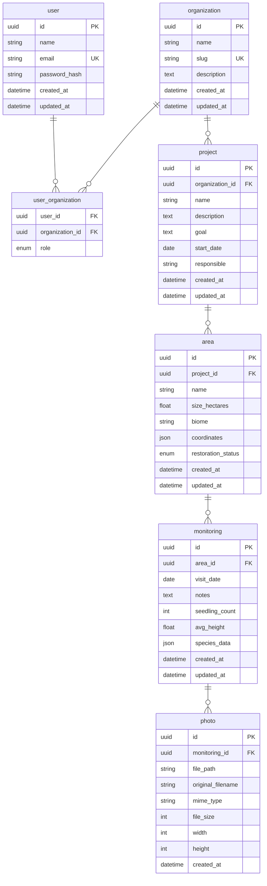

# Database Design — OpenForest MVP

> Date: 2026-07-29
> Status: Draft
> Scope: MVP (M1 — Foundation + Core Features)

## User Persona

Ana trabalha em uma ONG e coordena um projeto de restauração de mata ciliar. Ela usa Excel, Google Drive, WhatsApp e fotos do celular. Quer saber: quantas áreas existem, quando foram visitadas, quantas mudas foram plantadas, quantas sobreviveram, e ver fotos da evolução.

## User Journey (Ana)

1. Cria conta → **User**
2. Cria organização "Instituto Verde Vivo" → **Organization**
3. Cria projeto "Recuperação do Rio Cuiabá" → **Project**
4. Adiciona área "Área 01" (12ha, Cerrado, coordenadas) → **Area**
5. Vai a campo, registra visita (fotos, observações, mudas, altura, espécies) → **Monitoring** + **Photo**
6. Abre dashboard e enxerga progresso

## Design Decisions

- **Abordagem MVP equilibrado**: normalização moderada, sem overengineering.
- **Photos**: apenas metadados no banco. Binários no MinIO (implementação futura).
- **Species**: JSON field no Monitoring. Sem tabela separada no MVP — flexível para anotação de campo.
- **Coordinates**: JSON no MVP. Futuramente PostGIS `GEOMETRY`.
- **Roles**: enum na associação User↔Organization (admin, manager, researcher, volunteer, viewer).
- **Herança**: todos os models herdam de `Base` (UUID `id`, `created_at`, `updated_at`).

## Entities

### Base (SQLModel mixin)

```
id: UUID (PK, default uuid4)
created_at: datetime (UTC, auto)
updated_at: datetime (UTC, auto on update)
```

### User

Representa uma conta de usuário.

| Campo         | Tipo     | Restrições       |
|---------------|----------|------------------|
| id            | UUID     | PK               |
| name          | str      | NOT NULL          |
| email         | str      | UNIQUE, NOT NULL  |
| password_hash | str      | NOT NULL          |
| created_at    | datetime | auto              |
| updated_at    | datetime | auto              |

### Organization

Representa ONGs, prefeituras, institutos, etc.

| Campo       | Tipo     | Restrições      |
|-------------|----------|-----------------|
| id          | UUID     | PK              |
| name        | str      | NOT NULL         |
| slug        | str      | UNIQUE, NOT NULL |
| description | str      | nullable        |
| created_at  | datetime | auto            |
| updated_at  | datetime | auto            |

### UserOrganization

Associação N:N entre User e Organization com role.

| Campo          | Tipo  | Restrições                |
|----------------|-------|---------------------------|
| user_id        | UUID  | FK → User, PK composta      |
| organization_id| UUID  | FK → Organization, PK composta |
| role           | enum  | admin, manager, researcher, volunteer, viewer |

### Project

Pertence a uma organização. Ex: "Recuperação do Rio Cuiabá".

| Campo          | Tipo     | Restrições       |
|----------------|----------|------------------|
| id             | UUID     | PK               |
| organization_id| UUID     | FK → Organization |
| name           | str      | NOT NULL          |
| description    | text     | nullable         |
| goal           | text     | nullable         |
| start_date     | date     | nullable         |
| responsible    | str      | nullable (nome do responsável; futura FK → User) |
| created_at     | datetime | auto             |
| updated_at     | datetime | auto             |

### Area

Cada projeto contém uma ou mais áreas de restauração.

| Campo              | Tipo     | Restrições        |
|--------------------|----------|-------------------|
| id                 | UUID     | PK                |
| project_id         | UUID     | FK → Project      |
| name               | str      | NOT NULL           |
| size_hectares      | float    | nullable          |
| biome              | str      | nullable (ex: "Cerrado") |
| coordinates        | JSON     | nullable (ex: {"lat": -15.5, "lng": -56.0}) |
| restoration_status | enum     | planned, active, completed, cancelled; default planned |
| created_at         | datetime | auto              |
| updated_at         | datetime | auto              |

### Monitoring

Registro de uma visita de campo a uma área.

| Campo          | Tipo     | Restrições        |
|----------------|----------|-------------------|
| id             | UUID     | PK                |
| area_id        | UUID     | FK → Area         |
| visit_date     | date     | NOT NULL           |
| notes          | text     | nullable          |
| seedling_count | int      | nullable          |
| avg_height     | float    | nullable (metros) |
| species_data   | JSON     | nullable (ex: [{"name": "Ipê Amarelo", "count": 5}] |
| created_at     | datetime | auto              |
| updated_at     | datetime | auto              |

### Photo

Metadados de fotos tiradas durante uma visita. Binários no MinIO (futuro).

| Campo             | Tipo     | Restrições    |
|-------------------|----------|---------------|
| id                | UUID     | PK            |
| monitoring_id     | UUID     | FK → Monitoring |
| file_path         | str      | NOT NULL (chave no bucket MinIO) |
| original_filename | str      | nullable     |
| mime_type         | str      | nullable     |
| file_size         | int      | nullable (bytes) |
| width             | int      | nullable     |
| height            | int      | nullable     |
| created_at        | datetime | auto          |

## Entity-Relationship Diagram



## Data Flow (Ana's Journey)

```
POST /v1/auth/register          → User created
POST /v1/auth/login             → JWT tokens

POST /v1/organizations          → Organization created
POST /v1/organizations/{id}/members → Ana added as admin (auto on create)

POST /v1/projects               → Project created under Organization
POST /v1/areas                  → Area created under Project
POST /v1/monitorings            → Monitoring visit registered
POST /v1/monitorings/{id}/photos → Photo metadata saved

GET  /v1/projects/{id}/dashboard → Aggregated indicators (areas, visits, seedlings)
```

## Constraints & Indexes

- **UK**: User(email), Organization(slug)
- **FK CASCADE**: Organization → Project → Area → Monitoring → Photo (deleting an org removes everything). UserOrganization CASCADE on both sides.
- **Indexes**: 
  - `monitoring(area_id, visit_date)` — dashboard queries por área + data
  - `photo(monitoring_id)` — carregar fotos de uma visita
  - `project(organization_id)` — listar projetos de uma org

## Future Considerations

- **Species**: virar tabela separada com classificação taxonômica quando houver demanda pesquisador
- **PostGIS**: `coordinates` migrar de JSON para `GEOMETRY(Point, 4326)`
- **Media**: tabela `Photo` pode virar `Media` polimórfica se houver outros tipos de anexo
- **Audit log**: tabela separada para histórico de alterações
- **Sensors**: tabelas separadas para dados de sensores (M4 do roadmap)
